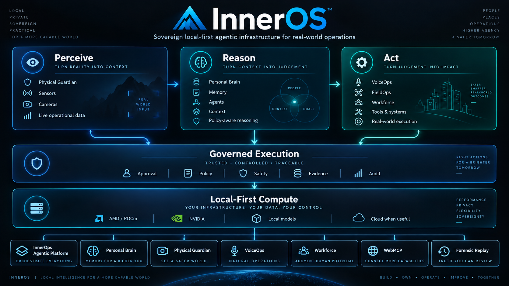
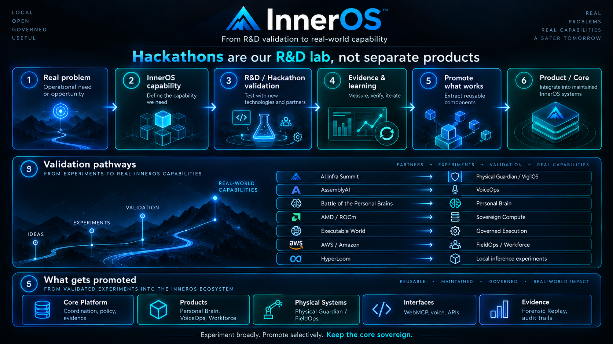

# Rafael López — InnerChispa

**AI infrastructure and agentic systems engineer building local-first, auditable software for real operations.**

I design and operate **InnerOS**: a governed multi-agent operating layer that connects software delivery, infrastructure, business workflows, persistent memory, and human approval. The objective is practical—return human attention by automating coordination, verification, recovery, and repetitive operational work.

[](https://innerchispa.us)
[](#inneros)
[](#engineering-principles)

## What I build

- **Agentic infrastructure:** durable multi-agent coordination, MCP/A2A integrations, scoped tools, task ownership, locks, evidence, and recovery.
- **Local AI systems:** private inference across NVIDIA and AMD/ROCm nodes, with capability-aware routing and cloud burst only when justified.
- **Operational products:** workforce, payroll, service operations, security, automation, and AI-assisted decision systems grounded in real company workflows.
- **Governed execution:** deterministic business rules, least privilege, human approval gates, bounded spending, and verifiable outcomes.

## InnerOS

InnerOS is not another chatbot. It is an operating layer for turning signals into safe, reviewable action:

```text
signal → relevance → memory → decision → delegation
       → execution → verification → recovery → evidence → learning
```

The system is designed around a simple truth: agents, services, models, and humans all fail. Reliable autonomy therefore requires persistent state, explicit authority, failure detection, bounded repair, and evidence before completion.

### Architecture at a glance

```text
Human / business / infrastructure signals
                  │
                  ▼
        InnerOS coordination plane
    identity • memory • policy • routing
                  │
       ┌──────────┼──────────┐
       ▼          ▼          ▼
 local models   cloud AI   specialist agents
       │          │          │
       └──────────┼──────────┘
                  ▼
 scoped tools • Git worktrees • business systems
                  │
                  ▼
 verification • recovery • audit evidence
```

<!-- INNEROS-ARCHITECTURE-VISUAL:START -->
<p align="center">
  
</p>

<p align="center"><sub><strong>InnerOS architecture.</strong> Perception, reasoning and action are connected through governed execution, evidence and local-first compute.</sub></p>
<!-- INNEROS-ARCHITECTURE-VISUAL:END -->

<!-- INNEROS-ECOSYSTEM-MAP:START -->
## InnerOS ecosystem map

InnerOS is developed as one system with several layers. Public repositories fall into one of these roles:

| Layer | Purpose | Representative projects |
|---|---|---|
| **Core Platform** | Coordination, policy, execution, routing, recovery and evidence | [InnerOps Agentic Platform](https://github.com/Rafa-Innerchispa/innerops-agentic-platform), [Forensic Replay](https://github.com/Rafa-Innerchispa/inneros-forensic-replay) |
| **Products** | Maintained capabilities built on top of the platform | [Personal Brain](https://github.com/Rafa-Innerchispa/inneros-personal-brain), [Workforce](https://github.com/Rafa-Innerchispa/innerspark-workforce-ai), VoiceOps, Physical Guardian |
| **Product Surfaces** | Governed interfaces into the private execution fabric | [WebMCP](https://github.com/Rafa-Innerchispa/inneros-webmcp) |
| **R&D / Hackathon Validation** | Bounded environments used to validate technologies and architectural hypotheses | AMD, AWS, AssemblyAI, Executable World, AI Infra Summit and related event repositories |
| **Evidence / Engineering Notes** | Public technical record of what worked, failed, changed and why | [Engineering Journal](https://github.com/Rafa-Innerchispa/inneros-engineering-journal) |

The relationship is deliberate:

```text
real operational problem
        ↓
InnerOS core capability
        ↓
bounded experiment / hackathon validation
        ↓
measured evidence
        ↓
reusable capability
        ↓
maintained product or platform layer
```

Hackathons are therefore part of the R&D process, not separate product identities. Submission repositories preserve the historical evidence; reusable engineering moves forward into maintained InnerOS components.

<!-- INNEROS-RD-VISUAL:START -->
<p align="center">
  
</p>

<p align="center"><sub><strong>R&D as a system.</strong> Hackathons and bounded experiments validate technology; only useful, evidenced capabilities are promoted into maintained InnerOS products or core infrastructure.</sub></p>
<!-- INNEROS-RD-VISUAL:END -->

<!-- INNEROS-ECOSYSTEM-MAP:END -->

<!-- INNEROS-FEATURED:START -->
## Start here

These six repositories best explain the current InnerOS system from platform to real-world operation:

| System | Role | Why it matters |
|---|---|---|
| [**InnerOps Agentic Platform**](https://github.com/Rafa-Innerchispa/innerops-agentic-platform) | **Core platform** | Governed multi-agent coordination, MCP/A2A, routing, bounded execution, recovery and evidence. |
| [**Personal Brain**](https://github.com/Rafa-Innerchispa/inneros-personal-brain) | **Cognitive layer** | Sovereign memory, context, live perception and governed reasoning across agents. |
| [**Physical Guardian**](https://github.com/Rafa-Innerchispa/inneros-physical-guardian-ai-infra-2026) | **Physical AI** | Cameras, sensors, edge perception, approval, verification and evidence for real environments. |
| [**WebMCP**](https://github.com/Rafa-Innerchispa/inneros-webmcp) | **Agent interface** | Browser-native access to local AI, project workspaces, execution lanes, evidence and bounded physical control. |
| [**FounderOS**](https://github.com/Rafa-Innerchispa/ralphiia-founderos-openai) | **Operational OS** | Connects conversation, memory, infrastructure, development and business operations into one practical founder loop. |
| [**AEGIS ForkGuard**](https://github.com/Rafa-Innerchispa/aegis-forkguard) | **Agent safety** | Counterfactual pre-execution firewall that forks possible futures before an autonomous agent commits an irreversible action. |

Together they show the full stack:

```text
coordination
    ↓
memory + reasoning
    ↓
perception + interfaces
    ↓
governed execution
    ↓
real-world operations
    ↓
evidence + safety
```

### Active products

- [**Workforce**](https://github.com/Rafa-Innerchispa/innerspark-workforce-ai) — attendance, incidents, reporting and deterministic pre-payroll automation.
- **VoiceOps** — governed voice interaction for operational actions, approval and evidence.
- **FieldOps** — human-approved workflows for real-world tasks and physical operations.
- **Ambient Guardian** — Alexa+/MCP orchestration for contextual, verified smart-environment actions.

### Core capabilities

- [**Forensic Replay**](https://github.com/Rafa-Innerchispa/inneros-forensic-replay) — content-addressed evidence, deterministic replay and counterfactual analysis.
- **DMX Engine** — bounded physical-control execution for lighting and stage automation.
- **MCP / A2A infrastructure** — agent-to-tool and agent-to-agent control surfaces across the ecosystem.

### R&D and validation

AMD/ROCm, HyperLoom, AWS, AssemblyAI, AI Infra Summit, Executable World and other hackathons are treated as **bounded R&D environments**. They validate technologies and architectural hypotheses; successful capabilities are promoted into maintained InnerOS products or core infrastructure.
<!-- INNEROS-FEATURED:END -->


## Engineering principles

1. **Local-first, not local-only.** Use private infrastructure by default; use cloud capacity when it creates measurable value.
2. **Evidence over confident claims.** A task is not complete without tests, runtime evidence, or an explicit truth boundary.
3. **Authority is part of the architecture.** High-impact actions require scoped permissions, approvals, and auditability.
4. **Failure is a normal state.** Detect stalls, prevent collisions, recover safely, and preserve what happened.
5. **Human attention is the metric.** Optimize for time returned, errors avoided, decisions prepared, and work actually closed.
6. **Freeze → Extract → Integrate.** Preserve hackathon submissions as historical artifacts; move reusable capabilities into maintained successors instead of rewriting the evidence.

## Current technical focus

- MCP and A2A control planes for heterogeneous agent fleets
- local model routing with AMD ROCm/vLLM and NVIDIA/Ollama infrastructure
- durable coordination, forensic replay, and recovery automation
- secure Git-based development through isolated branches and worktrees
- deterministic operational workflows backed by MongoDB, Qdrant, and Notion
- cost-aware cloud burst and short-lived infrastructure
- workforce, service operations, payroll, physical security, and automation

## Repository map

This account contains several kinds of repositories:

- **Canonical platform and products** — maintained InnerOS and business capabilities.
- **Hackathon submissions** — frozen snapshots that preserve what was submitted.
- **Successor projects** — continued development extracted from those snapshots.
- **Experimental probes** — bounded repositories used to prove or reject one technical hypothesis.
- **Public evidence and identity** — profile, engineering journal, demos, and documentation.

That distinction is intentional. Hackathon repositories are not silently rewritten after submission; reusable engineering is extracted into successor repositories with clearer ownership and lifecycle.

## Current priorities

- prove end-to-end autonomy through real operational workflows rather than agent demos;
- consolidate the InnerOS architecture and repository lineage into a recoverable system map;
- turn Workforce and Service Operations into production-quality products;
- strengthen security, observability, forensic replay, and self-healing behavior;
- measure human time returned and operational work closed.

## Connect

- **InnerChispa:** [innerchispa.us](https://innerchispa.us)
- **GitHub:** [github.com/Rafa-Innerchispa](https://github.com/Rafa-Innerchispa)

> Building AI systems that notice what matters, do what they safely can, verify the result, and return the human only when human judgment is genuinely required.
